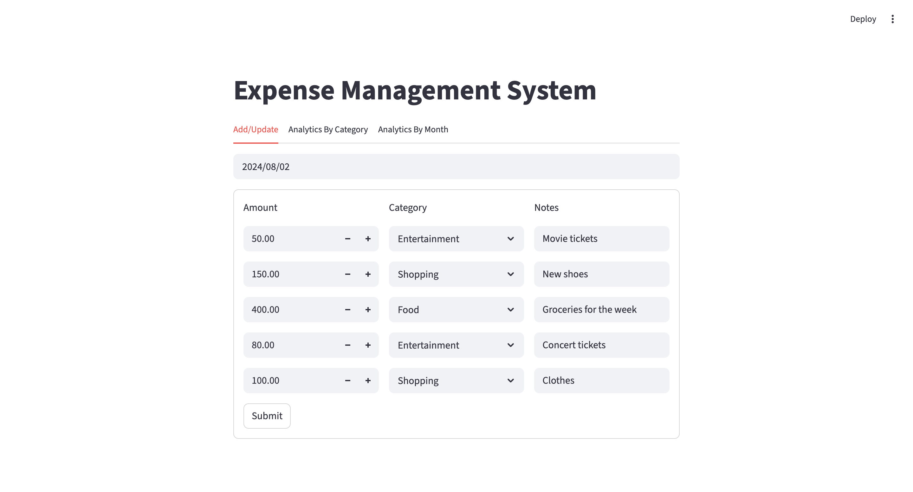
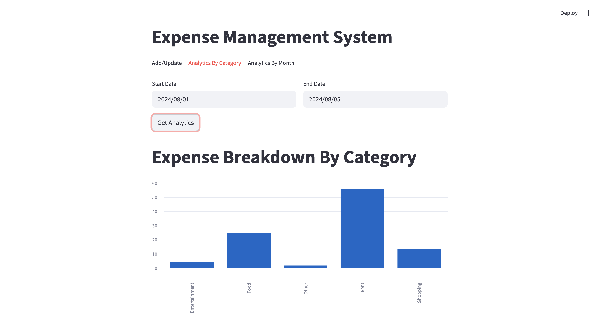
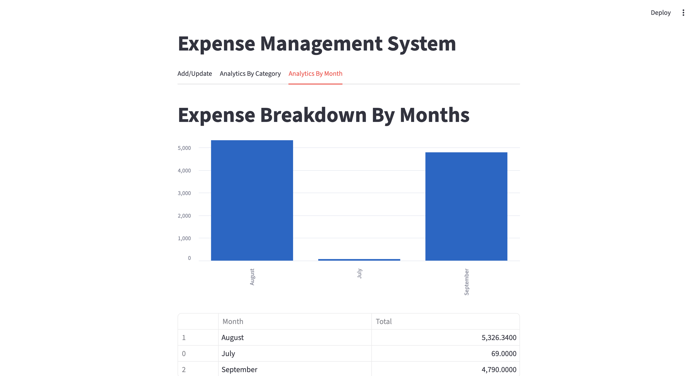

# Expense Management System

This project is an **Expense Management System** built with a **Streamlit frontend** and a **FastAPI backend**. It allows users to add or update daily expenses and analyze spending patterns by category and month.

The project helped me gain practical knowledge in **Python basics, Pandas data analysis, backend development using FastAPI, and frontend development using Streamlit**.

## Features

* Add and update daily expense records
* Store expense amount, category, date, and notes
* Analyze expenses by selected date range
* View expense breakdown by category
* View monthly expense summary
* Display analytics using bar charts
* Show monthly expense data in table format
* Connect Streamlit frontend with FastAPI backend
* Organize backend, frontend, and test files in a structured way

## Tech Stack

* **Programming Language:** Python
* **Frontend:** Streamlit
* **Backend:** FastAPI
* **Data Analysis:** Pandas
* **Testing:** Pytest
* **API Server:** Uvicorn
* **Version Control:** Git and GitHub

## Project Structure

```bash
project-1/
│
├── backend/
│   ├── db_helper.py
│   ├── logging_setup.py
│   ├── server.py
│   └── server.log
│
├── frontend/
│   ├── add_update_ui.py
│   ├── analytics_by_month_ui.py
│   ├── analytics_ui.py
│   └── app.py
│
├── test/
│   ├── backend/
│   │   └── test_db_helper.py
│   ├── frontend/
│   └── conftest.py
│
├── requirement.txt
└── README.md
```

## Application Pages

### 1. Add / Update Expense

The **Add/Update** page allows users to enter expense information such as date, amount, category, and notes. Users can submit multiple expense records for a selected date.

### 2. Analytics by Category

The **Analytics By Category** page allows users to select a start date and end date. Based on the selected date range, the system shows a category-wise expense breakdown using a bar chart.

### 3. Analytics by Month

The **Analytics By Month** page shows monthly expense summaries. It displays both a bar chart and a table so that users can easily compare expenses across different months.

## Setup Instructions

### 1. Clone the Repository

```bash
git clone https://github.com/Soumik77/Expense-Tracking-System.git
cd Expense-Tracking-System.git
```

### 2. Create a Virtual Environment

```bash
python3 -m venv venv
```

### 3. Activate the Virtual Environment

For macOS/Linux:

```bash
source venv/bin/activate
```

For Windows:

```bash
venv\Scripts\activate
```

### 4. Install Required Packages

```bash
pip install -r requirement.txt
```

## How to Run the Project

### 1. Start the FastAPI Backend Server

From the project root directory, run:

```bash
uvicorn backend.server:app --reload
```

The backend server will run at:

```bash
http://127.0.0.1:8000
```

You can also check the FastAPI documentation at:

```bash
http://127.0.0.1:8000/docs
```

### 2. Start the Streamlit Frontend

Open another terminal and run:

```bash
streamlit run frontend/app.py
```

The frontend application will open in your browser.

## Testing

To run the test cases, use:

```bash
pytest
```

This will run the available backend and frontend test files inside the `test/` directory.

## Screenshots

### Add / Update Expense Page



### Analytics by Category



### Analytics by Month



## What I Learned

Through this project, I learned and practiced:

* Python programming fundamentals
* Writing modular Python code
* Working with data using Pandas
* Building REST APIs using FastAPI
* Creating frontend applications using Streamlit
* Connecting frontend and backend using API calls
* Performing category-wise and month-wise data analysis
* Visualizing data using charts
* Writing test cases using Pytest
* Structuring a Python full-stack project

## Future Improvements

* Add user authentication
* Add income tracking feature
* Add budget limit and alert system
* Export expense reports as CSV or PDF
* Add database support such as MySQL or PostgreSQL
* Improve UI design and responsiveness
* Add more advanced dashboard analytics

## Conclusion

The **Expense Management System** is a practical Python-based project that combines frontend development, backend API development, and data analysis. It helped me understand how to build and structure a real-world full-stack application using Streamlit, FastAPI, and Pandas.

# Expense-Tracking-System
